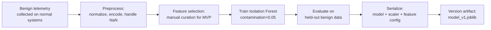
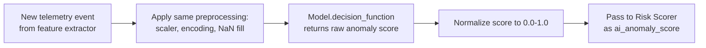

# AI Model — AI-Powered Personal Security Layer

---

## Critical Disclaimer

> **AI is not a perfect malware detector.**
>
> The AI/ML component of this system is one input into the risk scoring pipeline. It is not a standalone threat classifier and it does not make final decisions. All AI-generated scores are combined with rule-based signals, behavioral thresholds, and human review. The system explicitly avoids treating AI output as ground truth.

---

## 1. ML Problem Definition

The AI component solves two related but distinct problems:

### 1.1 MVP Problem: Anomaly Detection

**Problem type:** Unsupervised anomaly detection

**Question being answered:** "Does the current system behavior deviate significantly from what is normal for this type of system?"

**Why anomaly detection for the MVP?**

Supervised threat classification requires labeled training data — a dataset of feature vectors labeled as "malicious" or "benign." Building this dataset accurately takes significant time and expertise. For the MVP, we do not have a reliable labeled dataset.

Anomaly detection can be bootstrapped on general benign system behavior data and does not require malicious examples. It learns what "normal" looks like and flags deviations.

### 1.2 Future Problem: Supervised Threat Classification (Phase 2)

**Problem type:** Supervised binary or multiclass classification

**Question being answered:** "Given this feature vector, is this behavior consistent with known malicious activity? If so, what category?"

**Why deferred?** Requires labeled training data that must be carefully curated to avoid mislabeling or data leakage. This is Phase 2 work.

---

## 2. MVP Model: Isolation Forest

### What is Isolation Forest?

Isolation Forest is a tree-based anomaly detection algorithm. It identifies anomalies by isolating observations — anomalous points are easier to isolate (shorter paths in the tree) than normal points.

**Why Isolation Forest for MVP?**

| Criterion | Evaluation |
|---|---|
| No labeled data required | ✅ Unsupervised |
| Works on tabular feature data | ✅ Well-suited |
| Fast inference | ✅ < 1ms per sample on CPU |
| No GPU required | ✅ CPU-only |
| Interpretable | ⚠️ Partially (per-feature importance possible with SHAP) |
| Production-ready | ✅ scikit-learn implementation is stable |
| Performance on behavioral security data | ⚠️ Adequate for MVP; not state-of-the-art |

**Alternatives considered:**

| Model | Why not chosen for MVP |
|---|---|
| One-Class SVM | Slower inference; tuning is more complex |
| Autoencoder (neural) | Requires more data; overkill for MVP scale |
| Local Outlier Factor | Does not scale to inference on streaming data |
| Random Forest (supervised) | Requires labeled data — Phase 2 |
| XGBoost (supervised) | Requires labeled data — Phase 2 |

---

## 3. Dataset Requirements

### 3.1 MVP Dataset: Benign System Behavior

For the Isolation Forest MVP model, only **benign** behavior samples are needed.

**What to collect:**

- Feature vectors from normal system operation: web browsing, coding, document editing, idle.
- Collected from the agent's own feature extraction pipeline running on normal systems.
- Duration: at minimum several hours of benign activity per target system profile.

**Feature vector format (per sample):**

Each sample is a snapshot of system state at a point in time, consisting of the numerical features defined in [DETECTION_LOGIC.md](DETECTION_LOGIC.md).

Example columns:
```
file_modification_rate, new_process_rate, network_connection_count,
has_encoded_args, is_signed_binary, path_legitimacy_score,
process_tree_depth, parent_process_type_encoded,
is_headless, connects_on_unusual_port, is_in_temp_directory
```

### 3.2 Phase 2 Dataset: Labeled Threat Data

For supervised classification in Phase 2:

- Benign samples from 3.1 (label: 0)
- Malicious samples from controlled environments: sandboxes, malware analysis VMs (label: 1 or multiclass)
- Sources: public datasets (EMBER, CICIDS, CIC-MalMem), sandbox analysis of known malware samples
- Careful labeling strategy required — mislabeled samples reduce model reliability significantly

> **Note:** Training on malware samples must be done in an isolated environment. Malware samples must never be executed on a development or production machine.

---

## 4. Data Preprocessing

### 4.1 Feature Normalization

Numerical features are standardized before model training and inference:

```python
from sklearn.preprocessing import StandardScaler

scaler = StandardScaler()
X_train_scaled = scaler.fit_transform(X_train)
```

The fitted scaler is serialized alongside the model and applied identically during inference. **Using different preprocessing at training vs. inference time causes silent errors.**

### 4.2 Categorical Encoding

Categorical features (e.g., `parent_process_type`) are encoded as ordinal integers or one-hot vectors. The encoding mapping is versioned with the model.

### 4.3 Missing Value Handling

Some telemetry fields may be unavailable in certain situations (e.g., no parent PID for root processes). Strategy:

- Numerical: Fill with feature mean (computed from training set, stored with scaler).
- Categorical: Fill with a dedicated "UNKNOWN" category.

### 4.4 Feature Selection

Not all collected features need to be used by the model. Feature selection should be performed during training to:

- Remove redundant features.
- Reduce the input dimensionality.
- Improve inference speed.

For MVP, a manually curated feature set is acceptable. Automated feature selection is Phase 2.

---

## 5. Training Pipeline



### Training code (conceptual):

```python
from sklearn.ensemble import IsolationForest
from sklearn.preprocessing import StandardScaler
import joblib

# Load and preprocess data
X_train = preprocess(benign_data)

# Train
model = IsolationForest(
    n_estimators=100,
    contamination=0.05,  # Expected fraction of anomalies in training data
    random_state=42
)
model.fit(X_train)

# Serialize
joblib.dump({
    "model": model,
    "scaler": scaler,
    "feature_names": feature_names,
    "version": "v1.0",
    "trained_on": "2026-09-16"
}, "models/anomaly_model_v1.joblib")
```

> **`contamination` parameter:** Set to `0.05` (5%) as a conservative estimate. Higher values increase sensitivity but also false positives. This requires tuning.

---

## 6. Model Evaluation

### 6.1 MVP Evaluation (Unsupervised)

Since we lack labeled malicious samples for the MVP, evaluation is limited:

| Metric | Method |
|---|---|
| False positive rate on benign data | Hold out 20% of benign data; measure % flagged as anomalous |
| Score distribution | Visualize anomaly score distribution for benign samples |
| Threshold calibration | Adjust threshold to achieve < 5% FPR on benign held-out set |

### 6.2 Phase 2 Evaluation (Supervised, if labeled data available)

| Metric | Target |
|---|---|
| Precision | > 0.80 |
| Recall (Sensitivity) | > 0.75 |
| F1 Score | > 0.78 |
| False Positive Rate | < 10% |
| AUC-ROC | > 0.85 |

> **Important:** These are targets, not guarantees. Real-world performance depends heavily on data quality.

### 6.3 Confusion Matrix Interpretation

For this security context:

| Outcome | Meaning | Risk |
|---|---|---|
| True Positive | Real threat detected | Desired |
| True Negative | Benign behavior correctly passed | Desired |
| False Positive | Legitimate behavior flagged as threat | Annoyance; alert fatigue |
| False Negative | Real threat missed | Security gap |

Both false positives and false negatives have real costs. The system must be calibrated to balance them — not minimize only one.

---

## 7. Inference Pipeline



**Inference implementation principles:**

- The model is loaded once at agent startup. Do not reload on every event.
- Inference is synchronous but runs in a separate thread to avoid blocking telemetry collection.
- If the model fails to load, the agent logs the error and continues with rule-based detection only.
- The scaler and feature configuration must match exactly what was used during training.

---

## 8. Model Versioning

| Artifact | Content |
|---|---|
| `model_v1.joblib` | Serialized model + scaler + feature config + metadata |
| `feature_config_v1.yaml` | Canonical feature list and preprocessing parameters |
| `experiment_log.md` | Record of training runs, hyperparameters, and evaluation results |

**Version management rules:**

- Each new model version gets a new filename: `anomaly_model_v2.joblib`.
- The agent config specifies which model version to load.
- Old model versions are retained for rollback.
- Model version is included in every alert that uses AI scoring so results are reproducible.

---

## 9. Explainability

The AI anomaly score must not be a black box in alerts.

**MVP explainability approach:**

- SHAP (SHapley Additive exPlanations) values can be computed for Isolation Forest using the `shap` library.
- For each flagged event, compute per-feature SHAP values to identify which features contributed most to the anomaly score.
- Include the top 3 contributing features in the alert description.

Example alert output:
```
AI anomaly score: 0.78
Top contributing factors:
  1. file_modification_rate: 3.2x above normal baseline
  2. is_in_temp_directory: true (unusual for this process type)
  3. has_encoded_args: true
```

> SHAP integration is **Phase 2** if it impacts MVP timeline. The MVP may report the anomaly score without per-feature breakdown.

---

## 10. Model Limitations

| Limitation | Description |
|---|---|
| **No labeled malicious data at MVP** | The MVP model is trained only on benign data. Its ability to detect specific malware types is unknown and not guaranteed. |
| **Threshold sensitivity** | Anomaly detection thresholds require calibration per system. A threshold tuned on one machine may produce very different results on another. |
| **Feature dependency** | Model performance depends entirely on the quality and correctness of feature extraction. Poor features = poor detection. |
| **Novel threats may not be anomalous** | Sophisticated attackers can blend with normal behavior to avoid anomaly detection (adversarial evasion). |
| **No temporal awareness in MVP** | The MVP Isolation Forest treats each sample independently. It does not model sequences of events over time. |
| **Training data bias** | If training data is not representative of the user's actual usage, the false positive rate will be high. |
| **Model staleness** | As system behavior changes (new software installed, usage patterns shift), the model's baseline becomes stale without retraining. |
| **AI cannot guarantee detection** | A sufficiently well-crafted attack that stays within behavioral norms will not be detected by the anomaly model. |

---

## 11. Retraining Strategy

### MVP

No automatic retraining. The model is trained once and shipped with the agent. The user can manually trigger a retraining run using the provided training script on their own system.

### Phase 2

- Periodic retraining using the user's own benign telemetry to update the baseline.
- Retraining run initiated locally; new model evaluated before deployment.
- Retraining must not occur during active alert conditions (to avoid contaminating the benign baseline).

### Future

- Federated or cloud-assisted retraining using anonymized feature statistics (not raw data).
- Active learning: user-labeled alerts feed back into the training pipeline.

---

## 12. Summary: MVP Model vs. Future Model

| Aspect | MVP Model | Future Model |
|---|---|---|
| Type | Isolation Forest (unsupervised anomaly detection) | Random Forest / XGBoost (supervised classification) |
| Training data | Benign system behavior only | Labeled benign + malicious samples |
| Labeling required | No | Yes |
| Detection capability | Behavioral deviations from normal | Known threat categories |
| Explainability | Anomaly score + contributing features | Feature importance + classification reason |
| Retraining | Manual | Automated with safeguards |
| Inference | Local CPU | Local CPU (future: optional cloud) |

---

*Document version: 1.0 | Last updated: 2026-09-16*
