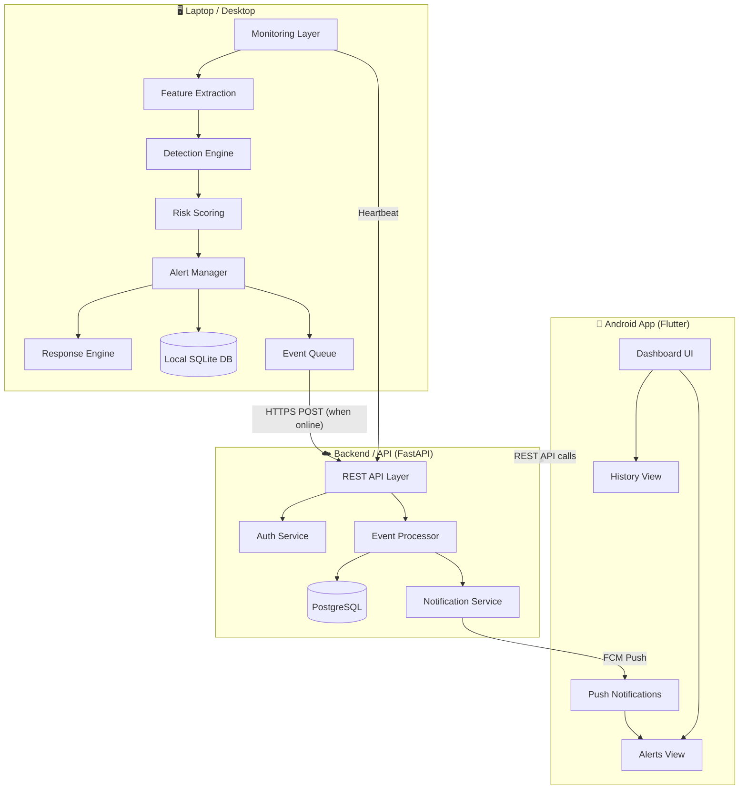
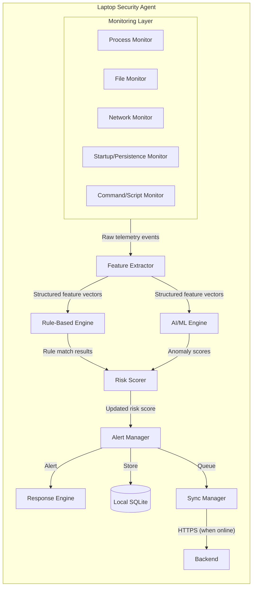
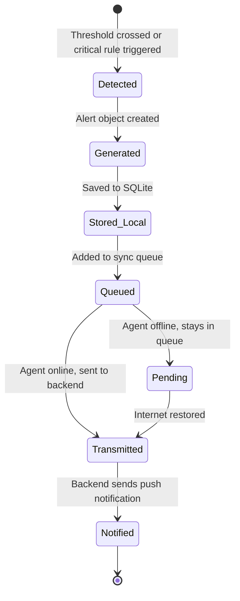
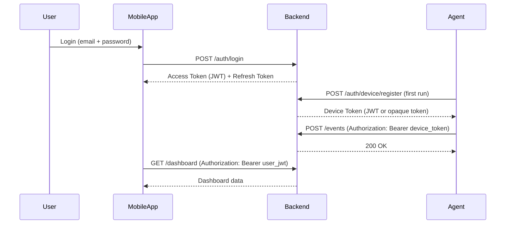
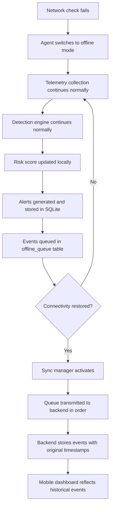
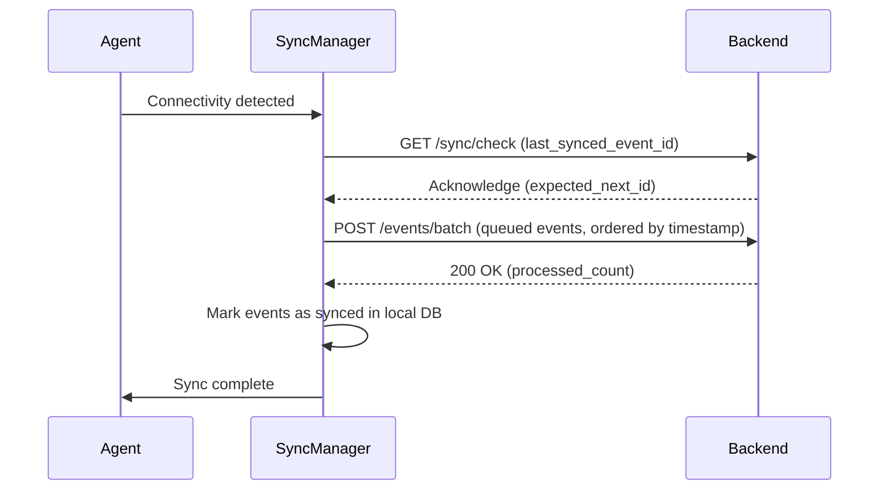

# Architecture — AI-Powered Personal Security Layer

---

## 1. Overall Architecture

The system is composed of three primary components connected through a defined communication architecture:



---

## 2. Laptop Security Agent Architecture

The agent is structured as a multi-threaded/multi-process Python application with clearly separated concerns. Each component runs independently and communicates through internal queues.



---

## 3. Monitoring Layer

The monitoring layer collects raw telemetry from the operating system. Each monitor runs independently as a background thread or coroutine.

### 3.1 Process Monitor

- Uses `psutil` to enumerate running processes on an interval (e.g., every 5 seconds).
- Captures: PID, parent PID, process name, executable path, command-line arguments, username, start time, CPU%, memory%.
- Detects: new process creation, process termination.
- On Windows, uses WMI or Event Log for real-time process creation events (polling is the MVP fallback).

### 3.2 File Monitor

- Uses `watchdog` with OS-native file system events.
- Monitored directories (configurable): user home directory, Desktop, Downloads, Documents, AppData/Temp, Windows System32 (read-only observation).
- Captures: file create, modify, delete, rename events — file path, event type, timestamp, owning process (where available).
- Computes SHA-256 hash for newly created or modified executable files.

### 3.3 Network Monitor

- Uses `psutil.net_connections()` polled on an interval (e.g., every 10 seconds).
- Captures: local address, local port, remote address, remote port, connection state, owning PID.
- Correlates connections to process names from the process monitor.
- Flags connections on unusual ports or to private-range IPs that are unexpected.

### 3.4 Startup / Persistence Monitor

- Monitors Windows Registry Run keys: `HKCU\Software\Microsoft\Windows\CurrentVersion\Run`, `HKLM\...`.
- Monitors Windows Startup folder.
- Monitors scheduled tasks via `schtasks` output or `winreg`.
- Detects additions, modifications, or deletions of persistence entries.
- Captures: key/value name, target executable path, modification time.

### 3.5 Command / Script Monitor

- Monitors process creation for known scripting hosts: `powershell.exe`, `cmd.exe`, `wscript.exe`, `cscript.exe`, `mshta.exe`, `certutil.exe`.
- Captures command-line arguments at process creation.
- Applies basic argument analysis: encoded commands (`-enc`), download cradles (`Invoke-WebRequest`, `WebClient`), execution policy bypass flags.

---

## 4. Feature Extraction

Raw telemetry events from the monitoring layer are transformed into structured feature vectors before passing to the detection engine.

**Extracted features include:**

| Feature Category | Examples |
|---|---|
| Process features | is_signed_binary, path_legitimacy_score, parent_process_type, process_tree_depth |
| Behavioral rate features | file_modification_rate_per_min, new_process_rate_per_min, network_connections_per_min |
| Command features | has_encoded_args, has_download_cradle, has_bypass_flags |
| File features | is_executable, file_extension_mismatch, target_is_system_dir |
| Network features | is_known_port, remote_ip_is_private, process_has_no_ui |
| Persistence features | new_startup_entry, entry_points_to_temp_dir, entry_is_unsigned |
| Temporal features | hour_of_day, is_off_hours | *(Phase 2)* |

All features are normalized to a consistent numeric range before model inference.

---

## 5. Detection Engine

The detection engine applies two parallel detection methods, whose results are combined by the Risk Scorer.

### 5.1 Rule-Based Engine

- Reads detection rules from YAML configuration files.
- Each rule specifies: rule ID, name, description, severity, conditions (field + operator + value), logic (AND/OR), and score contribution.
- Rules can be compound (multiple conditions must be met simultaneously).
- Rule engine produces: list of matched rule IDs, severity, and score delta for each match.

**Example rule (YAML):**
```yaml
rule_id: RB-001
name: "PowerShell encoded command execution"
severity: HIGH
score_contribution: 25
conditions:
  - field: process_name
    operator: equals
    value: "powershell.exe"
  - field: has_encoded_args
    operator: equals
    value: true
logic: AND
```

### 5.2 AI / ML Engine

- Loads a pre-trained scikit-learn model (Isolation Forest for MVP) at agent startup.
- Receives feature vectors from the feature extractor.
- Produces an anomaly score (0.0 = normal, 1.0 = highly anomalous) for each event window.
- Runs as a non-blocking background evaluation — does not delay telemetry collection.
- Anomaly score is passed to the Risk Scorer as an input.

> **Important:** The AI anomaly score is one input into the risk score. A high anomaly score alone does NOT trigger an alert. It must be considered in combination with rule matches and other signals.

---

## 6. Risk Scoring

The Risk Scorer maintains a real-time, decaying risk score (0–100) for the device.

**Score composition:**

```
Risk Score = f(
    rule_hit_score_deltas,       # Sum of score contributions from triggered rules
    ai_anomaly_score × weight,   # AI score weighted by confidence
    active_event_count,          # Penalty for multiple simultaneous events
    time_decay_factor            # Score decays over time without new signals
)
```

**Severity bands:**

| Score Range | Severity Level | Color |
|---|---|---|
| 0–30 | Low / Normal | 🟢 Green |
| 31–60 | Medium | 🟡 Yellow |
| 61–85 | High | 🟠 Orange |
| 86–100 | Critical | 🔴 Red |

The risk score is persisted to the local SQLite database every minute and to the backend whenever the score changes significantly (delta > 5 points) or a severity level changes.

---

## 7. Alert Manager

The Alert Manager generates structured security alerts when:

1. The risk score crosses a configured threshold (e.g., enters High or Critical).
2. A high-severity rule is triggered (regardless of overall score).
3. A critical behavioral pattern is observed (e.g., mass file encryption detected).

**Alert lifecycle:**



**Deduplication:** Alerts for the same ongoing event are suppressed if a similar alert was generated within the last N seconds (configurable). The alert is updated rather than duplicated.

---

## 8. Response Engine

The Response Engine handles optional automated defensive actions.

**MVP behavior (conservative):**

- Log the suspicious event and alert.
- Tag the event with a recommended action (e.g., `"Review process: PID 1234"`).
- Report the tag to the backend.
- No automatic process termination in the MVP.

**Future behavior (controlled):**

- Process termination upon user confirmation via mobile app.
- File quarantine: move file to a designated isolated directory.
- Network block: add a firewall rule via OS APIs (Windows Firewall).
- All actions are logged, reversible where possible.

> **Safety principle:** Automated responses carry the risk of false positives causing legitimate process or file disruption. All automated actions beyond logging must have a user confirmation gate.

---

## 9. Backend / API Architecture

The backend is a FastAPI application with the following internal structure:

```
backend/
├── app/
│   ├── api/            ← Route handlers (REST endpoints)
│   ├── auth/           ← JWT authentication, device token validation
│   ├── models/         ← SQLAlchemy ORM models
│   ├── schemas/        ← Pydantic request/response schemas
│   ├── services/       ← Business logic (event processing, alerting)
│   ├── db/             ← Database session management, migrations
│   └── notifications/  ← FCM push notification integration
```

**Responsibilities:**

- Authenticate and register devices and user accounts.
- Receive security events and alerts from registered agents via POST endpoints.
- Store all events, alerts, and risk scores in PostgreSQL.
- Serve the mobile app's dashboard data via GET endpoints.
- Send push notifications to mobile clients via FCM.
- Provide health check endpoints.

---

## 10. Database Architecture

**Backend Database:** PostgreSQL (relational, JSONB for flexible event payloads)

**Local Agent Database:** SQLite (event queue, local risk score history, cached state)

See [DATABASE_SCHEMA.md](DATABASE_SCHEMA.md) for full schema definition.

---

## 11. Mobile Application Architecture

The Flutter Android application follows a clean architecture pattern:

```
mobile/
├── lib/
│   ├── screens/        ← Dashboard, Alerts, History, Login screens
│   ├── widgets/        ← Reusable UI components
│   ├── services/       ← API service layer (dio-based)
│   ├── models/         ← Dart data models
│   ├── providers/      ← State management (Provider or Riverpod)
│   └── notifications/  ← FCM message handling
```

**Data flow in mobile app:**

1. User opens app → authenticates → JWT stored securely.
2. App fetches current device status, risk score, and recent events from backend REST API.
3. FCM delivers push notifications for new high-severity alerts.
4. User views alert details via a drill-down screen.

---

## 12. Authentication Architecture



---

## 13. Communication Architecture

| Communication Path | Protocol | Authentication |
|---|---|---|
| Agent → Backend (events) | HTTPS REST | Device token (JWT) |
| Agent → Backend (heartbeat) | HTTPS REST | Device token (JWT) |
| Mobile → Backend (dashboard) | HTTPS REST | User JWT |
| Backend → Mobile (alerts) | FCM Push | FCM service key |
| Backend → Mobile (real-time) | WebSocket *(future)* | User JWT |

All HTTP communication is over TLS 1.2+. No plaintext fallback.

---

## 14. Offline Operation Architecture

When the laptop loses internet connectivity:



**Key properties of offline mode:**

- No degradation in monitoring, detection, or local alerting.
- Events are persisted with original timestamps.
- No events are discarded due to offline state (up to the configured queue limit).
- On reconnection, events are synchronized before new events are sent.

---

## 15. Synchronization Flow



---

## 16. Error Handling and Failure Scenarios

| Failure Scenario | Behavior |
|---|---|
| Backend unreachable | Agent switches to offline mode; events queued locally |
| Agent crash | OS service manager restarts agent; SQLite state preserved |
| SQLite corruption | Agent logs error; attempts repair or resets queue; does not crash |
| AI model load failure | Detection falls back to rule-based only; error logged; alert sent to backend on reconnect |
| Rule file parse error | Agent logs error; skips invalid rules; continues with valid rules |
| Backend database failure | API returns 503; agent retries with exponential backoff |
| FCM delivery failure | Mobile app polls on next open; alert is not lost |
| Duplicate event on sync | Backend deduplicates by event ID; no duplicate records created |

---

## 17. Data Flow Diagram

See [DATA_FLOW.md](DATA_FLOW.md) for the complete data flow specification.

---

*Document version: 1.0 | Last updated: 2026-09-16*
