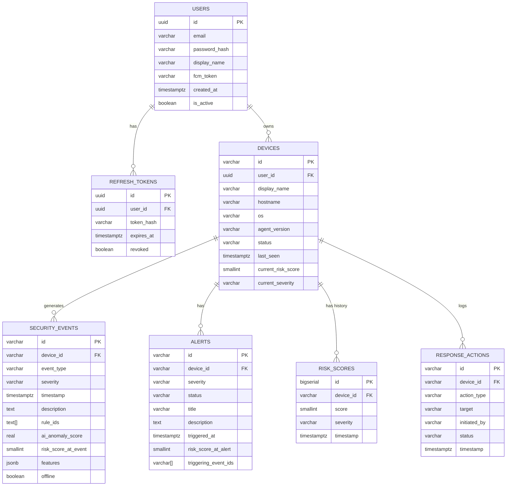

# Database Schema — AI-Powered Personal Security Layer

---

## Database Selection

### Backend Database: PostgreSQL 14+

**Rationale:**
- Relational model fits the structured, relationship-heavy data (users → devices → events → alerts).
- JSONB column support allows flexible storage of event feature payloads without over-normalizing.
- Excellent indexing, full-text search, and time-series-style queries for event history.
- Well-supported by SQLAlchemy ORM and Alembic migrations.

### Agent Local Database: SQLite

**Rationale:**
- Serverless, zero-configuration file database.
- Built into Python standard library (`sqlite3`).
- Sufficient for single-device, single-process local event storage and queueing.
- Not used for the backend.

---

## PostgreSQL Schema

### Table: `users`

Stores registered user accounts.

| Column | Type | Required | Description |
|---|---|---|---|
| `id` | UUID (PK) | ✅ | Unique user identifier |
| `email` | VARCHAR(255) UNIQUE | ✅ | User email address |
| `password_hash` | VARCHAR(255) | ✅ | bcrypt-hashed password |
| `display_name` | VARCHAR(100) | ✅ | Display name |
| `fcm_token` | VARCHAR(512) | ❌ | Firebase Cloud Messaging device token for push notifications |
| `created_at` | TIMESTAMPTZ | ✅ | Account creation timestamp |
| `updated_at` | TIMESTAMPTZ | ✅ | Last update timestamp |
| `is_active` | BOOLEAN | ✅ | Whether the account is active (default: true) |

**Indexes:**
- `idx_users_email` on `email` (for login lookup)

---

### Table: `refresh_tokens`

Stores active refresh tokens for session management.

| Column | Type | Required | Description |
|---|---|---|---|
| `id` | UUID (PK) | ✅ | Unique token record ID |
| `user_id` | UUID (FK → users.id) | ✅ | Owning user |
| `token_hash` | VARCHAR(255) | ✅ | SHA-256 hash of the refresh token |
| `expires_at` | TIMESTAMPTZ | ✅ | Token expiry time |
| `created_at` | TIMESTAMPTZ | ✅ | Token creation time |
| `revoked` | BOOLEAN | ✅ | Whether token has been explicitly revoked |

**Indexes:**
- `idx_refresh_tokens_user_id` on `user_id`
- `idx_refresh_tokens_token_hash` on `token_hash` (for validation lookup)

---

### Table: `devices`

Stores registered laptop/desktop devices.

| Column | Type | Required | Description |
|---|---|---|---|
| `id` | VARCHAR(50) (PK) | ✅ | Device ID (e.g., `dev_9x8y7z`) |
| `user_id` | UUID (FK → users.id) | ✅ | Owning user |
| `display_name` | VARCHAR(100) | ✅ | Human-readable device name |
| `hostname` | VARCHAR(255) | ✅ | Machine hostname at registration |
| `os` | VARCHAR(50) | ✅ | Operating system name |
| `os_version` | VARCHAR(50) | ❌ | OS version string |
| `agent_version` | VARCHAR(20) | ✅ | Version of the security agent installed |
| `device_token_hash` | VARCHAR(255) | ✅ | Hash of the device's authentication token |
| `status` | VARCHAR(20) | ✅ | `ONLINE` / `OFFLINE` / `UNKNOWN` |
| `last_seen` | TIMESTAMPTZ | ❌ | Last heartbeat received |
| `current_risk_score` | SMALLINT | ✅ | Latest risk score (0–100) |
| `current_severity` | VARCHAR(20) | ✅ | `LOW` / `MEDIUM` / `HIGH` / `CRITICAL` |
| `registered_at` | TIMESTAMPTZ | ✅ | Registration timestamp |
| `is_active` | BOOLEAN | ✅ | Whether device is active |

**Indexes:**
- `idx_devices_user_id` on `user_id`
- `idx_devices_status` on `status`

---

### Table: `security_events`

Stores all security telemetry events received from agents.

| Column | Type | Required | Description |
|---|---|---|---|
| `id` | VARCHAR(100) (PK) | ✅ | Event ID from agent (e.g., `evt_20260916_001`) |
| `device_id` | VARCHAR(50) (FK → devices.id) | ✅ | Source device |
| `event_type` | VARCHAR(50) | ✅ | `PROCESS_CREATION`, `FILE_MODIFICATION`, `NETWORK_CONNECTION`, `PERSISTENCE_CHANGE`, `SCRIPT_EXECUTION`, etc. |
| `severity` | VARCHAR(20) | ✅ | `LOW` / `MEDIUM` / `HIGH` / `CRITICAL` |
| `timestamp` | TIMESTAMPTZ | ✅ | Original event time on laptop |
| `received_at` | TIMESTAMPTZ | ✅ | Time event arrived at backend |
| `description` | TEXT | ✅ | Human-readable event description |
| `rule_ids` | VARCHAR[] | ❌ | Array of matched rule IDs |
| `ai_anomaly_score` | REAL | ❌ | AI model anomaly score (0.0–1.0) |
| `risk_score_at_event` | SMALLINT | ✅ | Device risk score at time of event |
| `features` | JSONB | ❌ | Extracted feature vector (structured attributes, no raw content) |
| `offline` | BOOLEAN | ✅ | Whether event was queued offline before transmission |

**Indexes:**
- `idx_security_events_device_id` on `device_id`
- `idx_security_events_timestamp` on `timestamp DESC`
- `idx_security_events_severity` on `severity`
- `idx_security_events_device_timestamp` on `(device_id, timestamp DESC)` — composite for dashboard queries

**Retention:** Events older than 30 days are eligible for archival or deletion. See [PRIVACY.md](PRIVACY.md).

---

### Table: `alerts`

Stores generated security alerts.

| Column | Type | Required | Description |
|---|---|---|---|
| `id` | VARCHAR(100) (PK) | ✅ | Alert ID (e.g., `alt_20260916_001`) |
| `device_id` | VARCHAR(50) (FK → devices.id) | ✅ | Source device |
| `severity` | VARCHAR(20) | ✅ | `LOW` / `MEDIUM` / `HIGH` / `CRITICAL` |
| `status` | VARCHAR(20) | ✅ | `ACTIVE` / `ACKNOWLEDGED` / `RESOLVED` |
| `title` | VARCHAR(255) | ✅ | Short, human-readable alert title |
| `description` | TEXT | ✅ | Full description of what was detected and why |
| `triggered_at` | TIMESTAMPTZ | ✅ | When the alert was generated (on laptop) |
| `received_at` | TIMESTAMPTZ | ✅ | When the alert arrived at the backend |
| `risk_score_at_alert` | SMALLINT | ✅ | Risk score at time of alert |
| `triggering_event_ids` | VARCHAR[] | ❌ | IDs of events that caused this alert |
| `repeat_count` | INTEGER | ✅ | Number of times this alert was re-triggered (for deduplication) |
| `acknowledged_at` | TIMESTAMPTZ | ❌ | When user acknowledged the alert |
| `acknowledgement_note` | TEXT | ❌ | User note on acknowledgement |
| `notification_sent` | BOOLEAN | ✅ | Whether a push notification was sent |

**Indexes:**
- `idx_alerts_device_id` on `device_id`
- `idx_alerts_triggered_at` on `triggered_at DESC`
- `idx_alerts_severity_status` on `(severity, status)` — for active alert queries

---

### Table: `risk_scores`

Stores historical risk score time-series data.

| Column | Type | Required | Description |
|---|---|---|---|
| `id` | BIGSERIAL (PK) | ✅ | Auto-increment record ID |
| `device_id` | VARCHAR(50) (FK → devices.id) | ✅ | Source device |
| `score` | SMALLINT | ✅ | Risk score value (0–100) |
| `severity` | VARCHAR(20) | ✅ | Corresponding severity level |
| `timestamp` | TIMESTAMPTZ | ✅ | Time of this score reading |

**Indexes:**
- `idx_risk_scores_device_timestamp` on `(device_id, timestamp DESC)` — primary query pattern

**Retention:** Risk score records older than 90 days are eligible for summarization or deletion. Granularity may be reduced to hourly averages for records older than 30 days.

---

### Table: `response_actions`

Records all defensive actions taken by the agent or initiated by the user.

| Column | Type | Required | Description |
|---|---|---|---|
| `id` | VARCHAR(100) (PK) | ✅ | Action ID |
| `device_id` | VARCHAR(50) (FK → devices.id) | ✅ | Device where action occurred |
| `action_type` | VARCHAR(50) | ✅ | `PROCESS_FLAGGED`, `PROCESS_TERMINATED` (P2), `FILE_QUARANTINED` (future), `NETWORK_BLOCKED` (future) |
| `target` | VARCHAR(512) | ✅ | Description of the target (process name + PID, file path, etc.) |
| `initiated_by` | VARCHAR(20) | ✅ | `AGENT_AUTO` / `USER_MOBILE` |
| `status` | VARCHAR(20) | ✅ | `COMPLETED` / `FAILED` / `PENDING` |
| `note` | TEXT | ❌ | Agent or user-provided note |
| `timestamp` | TIMESTAMPTZ | ✅ | When the action occurred |
| `related_event_id` | VARCHAR(100) (FK → security_events.id) | ❌ | Event that triggered this action |
| `related_alert_id` | VARCHAR(100) (FK → alerts.id) | ❌ | Alert associated with this action |

**Indexes:**
- `idx_response_actions_device_id` on `device_id`
- `idx_response_actions_timestamp` on `timestamp DESC`

---

## ER Diagram

---

## SQLite Schema (Agent Local Database)

The agent uses SQLite for local persistence. Tables mirror the backend schema where appropriate but are simplified.

### Key tables in local SQLite:

| Table | Purpose |
|---|---|
| `local_events` | All security events (mirrored to backend when online) |
| `local_alerts` | All generated alerts |
| `offline_queue` | Events and alerts pending sync to backend |
| `risk_score_history` | Local copy of risk score time-series |
| `sync_state` | Last synced event ID, last sync timestamp |
| `agent_config_cache` | Cached configuration values |

---

## Data Security Considerations

| Concern | Mitigation |
|---|---|
| Password storage | bcrypt hashed; plaintext never stored |
| Device token storage | Only the hash is stored in the database; the plaintext token is shown once on registration |
| Refresh token storage | SHA-256 hash stored; plaintext not stored after issue |
| JSONB feature payload | Does not contain raw file content, passwords, or personal data |
| FCM token | Sensitive device identifier; should be treated as a credential |
| Database access | Backend only; not directly accessible from the agent or mobile app |
| Encryption at rest | Recommended for production deployment; database-level encryption (PostgreSQL Transparent Data Encryption or disk-level encryption) |

---

## Indexing Strategy

Queries are dominated by:

1. **Dashboard load:** `security_events` and `alerts` by `(device_id, timestamp DESC)`.
2. **Risk score chart:** `risk_scores` by `(device_id, timestamp DESC)`.
3. **Alert management:** `alerts` by `(device_id, status, severity)`.
4. **Sync check:** `security_events` by `(device_id, id)` for last-received lookup.

All primary query patterns have composite indexes defined.

---

## Data Retention Policy

| Table | Retention |
|---|---|
| `security_events` | 30 days full granularity; archival after 30 days |
| `alerts` | 90 days |
| `risk_scores` | 30 days full; hourly averages for 30–90 days |
| `response_actions` | 90 days |
| `refresh_tokens` | Deleted when expired or revoked |
| `users` | Retained until account deletion |
| `devices` | Retained until device deregistered or account deleted |

---

*Document version: 1.0 | Last updated: 2026-09-16*
