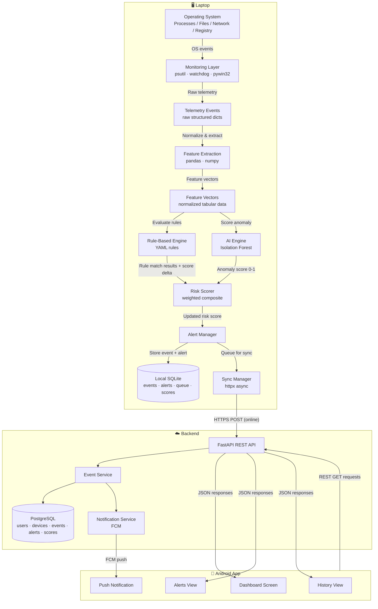
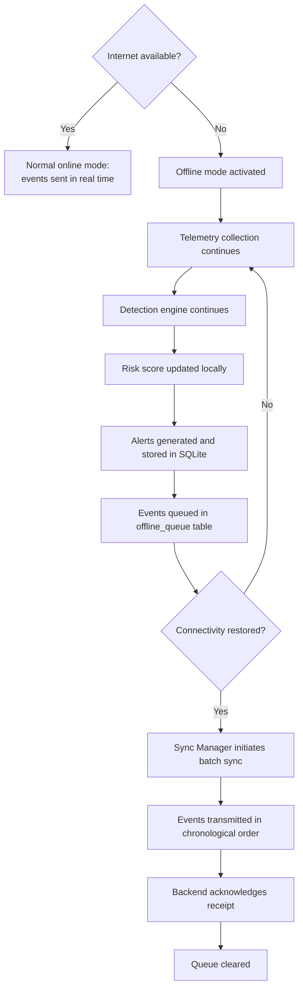
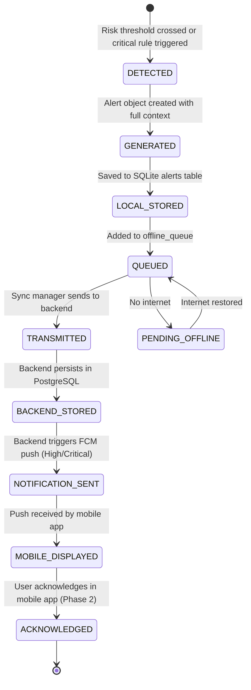

# Data Flow — AI-Powered Personal Security Layer

---

## Overview

This document describes the complete journey of data through the system, from initial collection on the laptop to display on the Android mobile dashboard. It also describes offline behavior, synchronization, and the alert lifecycle.

---

## 1. End-to-End Data Flow



---

## 2. What Data Is Collected

The monitoring layer collects the following raw telemetry from the operating system. **No personal file content is ever captured.**

### 2.1 Process Telemetry

| Field | Description | Example |
|---|---|---|
| `pid` | Process ID | 4512 |
| `ppid` | Parent Process ID | 2480 |
| `name` | Process name | `powershell.exe` |
| `exe` | Full executable path | `C:\Windows\System32\WindowsPowerShell\v1.0\powershell.exe` |
| `cmdline` | Command-line arguments | `-enc SGVsbG8gV29ybGQ=` |
| `username` | Running user | `DESKTOP-ABC\User` |
| `create_time` | Process creation timestamp | `2026-09-16T08:12:30Z` |
| `status` | Running / sleeping / zombie | `running` |

### 2.2 File Telemetry

| Field | Description | Example |
|---|---|---|
| `event_type` | CREATE / MODIFY / DELETE / RENAME | `CREATE` |
| `src_path` | Source file path | `C:\Users\User\Downloads\installer.exe` |
| `dest_path` | Destination path (for RENAME) | `C:\Users\User\AppData\Temp\svchost32.exe` |
| `timestamp` | Event timestamp | `2026-09-16T08:12:35Z` |
| `sha256` | File hash (executables only) | `a3f2c1...` |

### 2.3 Network Telemetry

| Field | Description | Example |
|---|---|---|
| `pid` | Process PID owning connection | 4512 |
| `process_name` | Process name | `powershell.exe` |
| `laddr` | Local address and port | `192.168.1.5:50012` |
| `raddr` | Remote address and port | `104.21.45.8:443` |
| `status` | Connection state | `ESTABLISHED` |
| `type` | TCP or UDP | `TCP` |
| `timestamp` | Observation timestamp | `2026-09-16T08:12:40Z` |

### 2.4 Persistence / Startup Telemetry

| Field | Description | Example |
|---|---|---|
| `event_type` | ADD / MODIFY / DELETE | `ADD` |
| `location` | Registry key or folder path | `HKCU\...\Run` |
| `name` | Entry name | `updater` |
| `target` | Target executable path | `C:\AppData\Temp\updater.exe` |
| `timestamp` | Detection timestamp | `2026-09-16T08:13:00Z` |

### 2.5 Command / Script Telemetry

| Field | Description | Example |
|---|---|---|
| `pid` | PID of scripting host | 5234 |
| `process_name` | Scripting host name | `powershell.exe` |
| `cmdline` | Full command-line | `-enc SGVsbG8gV29ybGQ=` |
| `has_encoded_args` | Detected encoded payload | `true` |
| `has_download_cradle` | Download cradle keywords detected | `false` |
| `timestamp` | Timestamp | `2026-09-16T08:14:00Z` |

---

## 3. What Data Is Processed Locally

All of the following processing happens **on the laptop**, before any data is transmitted:

| Processing Step | Local or Remote |
|---|---|
| Raw telemetry collection | **Local** |
| Feature extraction and normalization | **Local** |
| Rule-based detection | **Local** |
| AI anomaly scoring | **Local** |
| Risk score computation | **Local** |
| Alert generation | **Local** |
| Local event storage (SQLite) | **Local** |
| Offline event queueing | **Local** |

The AI model runs entirely locally. **No raw telemetry is sent to any external AI service.**

---

## 4. What Data Is Sent to the Backend

Only structured, processed data is transmitted to the backend. Raw process or file content is never transmitted.

| Data Type | Format | When sent |
|---|---|---|
| Security event (structured) | JSON | On event creation (if online) or on reconnect (offline queue) |
| Security alert | JSON | On alert creation |
| Risk score update | JSON | On significant change (delta > 5) or on severity band change |
| Device heartbeat | JSON (minimal) | Every 60 seconds |
| Device registration | JSON | Once, on first run |

**Example security event payload sent to backend:**

```json
{
  "device_id": "dev_abc123",
  "event_id": "evt_20260916_001",
  "event_type": "PROCESS_CREATION",
  "timestamp": "2026-09-16T08:12:30Z",
  "severity": "HIGH",
  "rule_ids": ["SCRIPT-001"],
  "ai_anomaly_score": 0.72,
  "risk_score_at_event": 67,
  "features": {
    "process_name": "powershell.exe",
    "has_encoded_args": true,
    "is_in_temp_directory": false,
    "parent_process_type": "OFFICE_APP",
    "path_legitimacy_score": 0.9
  },
  "description": "PowerShell executed with encoded command argument from parent process: winword.exe",
  "offline": false
}
```

> Note: `features` contains derived attributes, not raw command-line content. The encoded command itself is **not** transmitted to the backend in the MVP.

---

## 5. What Data Is Stored

### 5.1 Local (SQLite — on laptop)

| Table | Content |
|---|---|
| `events` | All security events with full feature data |
| `alerts` | Generated alerts |
| `risk_score_history` | Timestamped risk score records |
| `offline_queue` | Events and alerts queued for sync |
| `sync_state` | Last synced event ID, sync timestamps |
| `agent_config` | Local copy of current configuration |

### 5.2 Backend (PostgreSQL)

| Table | Content |
|---|---|
| `users` | User account data |
| `devices` | Registered devices and status |
| `security_events` | All events received from agents |
| `alerts` | All alerts with severity and status |
| `risk_scores` | Historical risk scores per device |
| `response_actions` | Actions taken by agent or user |
| `sessions` | Active user session tokens |

See [DATABASE_SCHEMA.md](DATABASE_SCHEMA.md) for complete schema.

---

## 6. What Data Reaches the Mobile Application

The mobile app receives data through REST API calls. It only ever receives data that has been:

1. Transmitted from the agent to the backend.
2. Processed and stored by the backend.
3. Retrieved via authenticated GET requests.

| Mobile Screen | Data Fetched |
|---|---|
| Dashboard | Device status, current risk score, last 5 alerts |
| Alerts View | All alerts for the device, paginated |
| Event Detail | Full event record (features, rule matches, AI score) |
| History View | Risk score history (last 7 days), event history paginated |
| Push Notification | Alert ID, severity, short description (FCM payload) |

**What the mobile app does NOT receive:**

- Raw command-line arguments.
- Actual file contents.
- Usernames beyond what is necessary for display.
- Network packet content.

---

## 7. Offline Behavior



**Offline limits:**

- Maximum offline queue size: 10,000 events (configurable).
- When queue is full, oldest events are rotated out (with a warning logged).
- Risk score history is still maintained locally even when the queue is full.
- The mobile app shows the device as "Offline / Last seen [timestamp]" during extended offline periods.

---

## 8. Synchronization Flow

```mermaid
sequenceDiagram
    participant Agent
    participant SyncManager
    participant Backend

    Note over Agent: Internet restored
    Agent->>SyncManager: Notify: connectivity available
    SyncManager->>Backend: GET /sync/state?device_id=dev_abc123
    Backend-->>SyncManager: last_received_event_id: evt_000045

    SyncManager->>SyncManager: Query offline_queue\nWHERE id > evt_000045\nORDER BY timestamp ASC

    SyncManager->>Backend: POST /events/batch\n(events 46–200, JSON array)
    Backend-->>SyncManager: 200 OK, processed: 155

    SyncManager->>SyncManager: Mark synced events as status='synced'\nin local SQLite

    SyncManager->>Backend: POST /risk-scores/batch\n(risk score history during offline period)
    Backend-->>SyncManager: 200 OK

    SyncManager->>Agent: Sync complete; resume real-time mode
```

**Sync guarantees:**

- Events are transmitted in chronological order.
- Events already received by the backend are not retransmitted (idempotent by event ID).
- If batch sync fails partway, the sync restarts from the last acknowledged event ID.

---

## 9. Alert Lifecycle



---

## 10. Data Retention and Deletion

| Data Location | Retention Policy |
|---|---|
| Local SQLite (agent) | Events kept for 30 days; older events purged by agent cleanup task |
| Backend PostgreSQL | Events kept for 30 days minimum; configurable |
| Offline queue | Cleared upon successful sync |
| Push notifications | Ephemeral — delivered once; not stored by FCM after delivery |
| Mobile app cache | Cleared on logout or app reset |

See [PRIVACY.md](PRIVACY.md) for data minimization and user rights.

---

*Document version: 1.0 | Last updated: 2026-09-16*
