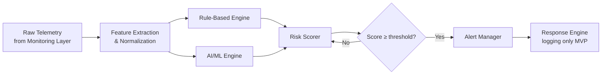

# Detection Logic — AI-Powered Personal Security Layer

---

## Fundamental Principle

> **A single suspicious event does not mean malware.**
>
> Every computer runs processes that look unusual in isolation. The goal of the detection pipeline is to evaluate the *combination* of signals over time, not to react to any single event. False positives are a real and serious concern — an overly aggressive detector that constantly cries wolf is worse than no detector at all.

The detection pipeline in this system follows this philosophy:

```
Single suspicious signal → Increases score slightly
Multiple correlated signals → Significant score increase
Multiple signals + rule match → Alert generated
```

---

## 1. Detection Pipeline Overview



---

## 2. Process Monitoring and Detection

### What is collected

| Field | Source |
|---|---|
| Process name | psutil / OS |
| PID, Parent PID | psutil / OS |
| Executable path | psutil / OS |
| Command-line arguments | psutil / WMI |
| Username | psutil / OS |
| Process start time | psutil / OS |
| CPU % and memory % | psutil (periodic sample) |
| Signature status | Windows Authenticode verification |

### Detection logic

| Signal | Detection approach | Score contribution |
|---|---|---|
| Unknown/unsigned executable in user-writable directory | Rule: unsigned_in_temp | Medium |
| Process spawned by unusual parent (e.g., Word → cmd.exe) | Rule: suspicious_parent_child | High |
| Process with no window running from Temp/AppData | Rule: headless_process_in_temp | Medium |
| Very high CPU usage by an unknown process | Behavioral threshold | Low |
| Process with no UI creating network connections | Rule: networkless_gui_process | Medium |

### Process relationship analysis

Parent-child process relationships reveal attack chains:

```
Legitimate:
    explorer.exe → chrome.exe → chrome.exe (child tabs)
    
Suspicious:
    winword.exe → cmd.exe → powershell.exe
    (Office spawning PowerShell is a common malicious macro pattern)
```

The agent maintains a process tree in memory and evaluates new process creations in context of their parent.

**Suspicious parent-child relationships flagged:**

| Parent | Child | Suspicion Level |
|---|---|---|
| winword.exe, excel.exe, outlook.exe | cmd.exe, powershell.exe, wscript.exe | High |
| explorer.exe | powershell.exe -enc ... | Medium |
| powershell.exe | cmd.exe or another powershell.exe | Medium |
| svchost.exe | Any process not in System32 | High |
| browser process | cmd.exe | High |

---

## 3. File Activity Detection

### What is collected

| Field | Source |
|---|---|
| Event type | watchdog (CREATE, MODIFY, DELETE, RENAME) |
| File path | watchdog |
| File extension | derived from path |
| SHA-256 hash | computed on file creation/modification (executables only) |
| Timestamp | OS-provided file event time |

### Detection logic

| Signal | Detection approach | Score contribution |
|---|---|---|
| Mass file modifications in a short window (>50 files/min) | Behavioral rate threshold | Very High |
| Files being renamed with double extension (`.pdf.exe`) | Rule: double_extension_rename | High |
| Executable created in Temp or Downloads folder | Rule: exec_in_temp | Medium |
| Known malicious file hash (SHA-256 lookup) | Signature match | Very High |
| Script file created in startup location | Rule: script_in_startup | High |
| Shadow copy deletion command detected | Process + command rule combined | Critical |

### Ransomware-like behavior heuristic

Ransomware typically modifies many files in rapid succession and may delete backup copies.

```
Signal 1: > 50 file modification events in 60 seconds
       +
Signal 2: Files in user document directories affected
       +
Signal 3: Originating process is unknown/unsigned
       ↓
Risk score spike → Alert: Possible mass-encryption behavior
```

> **False positive risk:** Legitimate backup or sync software (e.g., cloud sync clients during large uploads) can trigger this. Configured exclusion paths can mitigate this.

---

## 4. Network Activity Detection

### What is collected

| Field | Source |
|---|---|
| Local address and port | psutil.net_connections() |
| Remote address and port | psutil.net_connections() |
| Connection state | psutil.net_connections() |
| Owning PID → process name | psutil correlated |
| Protocol (TCP/UDP) | psutil.net_connections() |

### Detection logic

| Signal | Detection approach | Score contribution |
|---|---|---|
| Process connecting on unusual port (1-1024 except common services) | Rule: unusual_port_outbound | Medium |
| Process connecting to external IP on high port without user interaction | Behavioral rule | Medium |
| Previously-no-network process establishing outbound connection | Behavioral: process baseline deviation | Medium-High |
| Connection to private-range IP from a process with no legitimate LAN use | Rule: unexpected_lan_connection | Low-Medium |
| Many new connections in a short window from one process | Behavioral threshold | High |

### C2 communication patterns (future with threat intel)

```
Signal 1: Unusual process making outbound connection
       +
Signal 2: Connection on non-standard port
       +
Signal 3: Process is not signed / from Temp directory
       +
Signal 4 [Phase 2]: IP matches known malicious IP in threat feed
       ↓
High confidence: Possible C2 communication
```

> **Note:** Without threat intelligence feeds (Phase 2), IP-based detection is behavioral, not signature-based. IP blocking or flagging known-bad IPs is not available in the MVP.

---

## 5. Persistence / Startup Change Detection

### What is monitored

| Location | Monitored via |
|---|---|
| `HKCU\Software\Microsoft\Windows\CurrentVersion\Run` | Windows Registry monitoring |
| `HKLM\Software\Microsoft\Windows\CurrentVersion\Run` | Windows Registry monitoring |
| `%APPDATA%\Microsoft\Windows\Start Menu\Programs\Startup` | File monitor + path rule |
| Scheduled tasks | `schtasks /query` periodic polling |

### Detection logic

| Signal | Detection approach | Score contribution |
|---|---|---|
| New registry Run key added | Rule: new_run_key | High |
| Run key points to Temp or AppData directory | Rule: run_key_in_temp | Very High |
| Run key target is an unsigned executable | Rule: run_key_unsigned | High |
| New scheduled task created by non-admin process | Rule: task_by_nonprivileged | High |
| File added to Startup folder | Rule: startup_folder_add | Medium |

---

## 6. Script and Command Execution Detection

### What is monitored

| Scripting Host | Monitored Arguments |
|---|---|
| `powershell.exe` | All arguments; specifically: `-enc`, `-ep bypass`, `-noprofile`, `-w hidden`, `Invoke-WebRequest`, `WebClient`, `DownloadString`, `IEX`, `Start-Process` |
| `cmd.exe` | Arguments containing `certutil`, `bitsadmin`, chained commands |
| `wscript.exe` / `cscript.exe` | Script path; unusual paths |
| `mshta.exe` | Any invocation (rarely legitimate) |
| `certutil.exe` | `-decode`, `-urlcache` flags |

### Detection rules examples

**Rule: PowerShell encoded command**

```yaml
rule_id: SCRIPT-001
name: "PowerShell encoded command execution"
description: >
  PowerShell was invoked with -enc or -EncodedCommand flag.
  This is commonly used by malware to hide script content from casual inspection.
severity: HIGH
score_contribution: 30
conditions:
  - field: process_name
    operator: equals
    value: "powershell.exe"
  - field: has_encoded_args
    operator: equals
    value: true
logic: AND
```

**Rule: PowerShell download cradle**

```yaml
rule_id: SCRIPT-002
name: "PowerShell download cradle"
description: >
  PowerShell arguments contain patterns associated with downloading
  and executing code from the internet.
severity: HIGH
score_contribution: 35
conditions:
  - field: process_name
    operator: equals
    value: "powershell.exe"
  - field: args_contain_any
    operator: contains_any
    value: ["Invoke-WebRequest", "WebClient", "DownloadString", "DownloadFile", "IWR", "IEX"]
logic: AND
```

---

## 7. Suspicious Behavioral Patterns

These are compound patterns that combine multiple telemetry signals to identify known attack techniques.

### Pattern: Living-off-the-Land (LotL)

```
Office application running
        +
Spawns cmd.exe or PowerShell
        +
PowerShell downloads content from internet
        +
New executable created in Temp
        ↓
Pattern: Malicious macro → dropper chain
Risk contribution: Very High
```

### Pattern: Privilege Escalation Attempt

```
Process running as standard user
        +
Attempts to access protected registry key (access denied events)
        +
Creates a process with different username
        ↓
Pattern: Possible privilege escalation
Risk contribution: High
```

### Pattern: Ransomware-Like Encryption

```
Unknown process
        +
Mass file modifications (>50/min) in Documents
        +
Shadow copy deletion command in cmd.exe
        +
No network backup application running
        ↓
Pattern: Possible ransomware
Risk contribution: Critical — alert immediately
```

### Pattern: C2 Beacon

```
Unknown/unsigned process
        +
No visible UI or user interaction
        +
Periodic outbound connections at regular intervals
        +
Connections to non-standard ports
        ↓
Pattern: Possible C2 communication
Risk contribution: High
```

---

## 8. Feature Extraction for Detection

Raw telemetry events are normalized into structured features before evaluation:

| Feature | Type | Description |
|---|---|---|
| `is_signed_binary` | bool | Is the executable signed by a trusted publisher? |
| `path_legitimacy_score` | float 0–1 | Is the path a typical location for this type of process? |
| `parent_process_type` | categorical | Office app / Browser / System / Shell / Unknown |
| `process_tree_depth` | int | How deep in the process tree is this process? |
| `file_modification_rate` | float | Files modified per minute (rolling window) |
| `new_process_rate` | float | Processes created per minute |
| `network_connection_count` | int | Active connections for this process |
| `has_encoded_args` | bool | Does the command line contain Base64-encoded content? |
| `has_download_cradle` | bool | Are download-related keywords present in arguments? |
| `is_headless` | bool | No visible window, running in background |
| `connects_on_unusual_port` | bool | Network connection on a non-standard port |
| `is_in_temp_directory` | bool | Executable running from a temp or download directory |
| `new_run_key_created` | bool | A new startup registry key was added |
| `run_key_target_unsigned` | bool | The startup entry points to an unsigned executable |

---

## 9. Risk Scoring Logic

The risk score is a composite value combining detection signals:

```
base_score = 0

for each matched rule:
    base_score += rule.score_contribution * severity_weight

ai_contribution = ai_anomaly_score × 20   # max 20 points from AI alone

combined_score = base_score + ai_contribution

# Cap at 100
risk_score = min(100, combined_score)

# Time decay: every 5 minutes without new events, decay by 3 points
risk_score = max(0, risk_score - decay_amount)
```

**Severity weights:**

| Severity | Weight |
|---|---|
| CRITICAL | 2.0 |
| HIGH | 1.5 |
| MEDIUM | 1.0 |
| LOW | 0.5 |

---

## 10. Threat Severity Levels

| Level | Score Range | Meaning | Action |
|---|---|---|---|
| 🟢 **Low** | 0–30 | Normal operation; some minor anomalies possible | Monitor only |
| 🟡 **Medium** | 31–60 | Suspicious activity; worth reviewing | Log + queue alert |
| 🟠 **High** | 61–85 | Multiple suspicious signals; likely requires investigation | Alert + notify mobile |
| 🔴 **Critical** | 86–100 | Severe threat signals; immediate attention recommended | Alert + urgent push notification |

---

## 11. Alert Generation Logic

An alert is generated when:

1. Risk score transitions from one severity band to a higher one.
2. A CRITICAL-severity rule is matched independently of the score.
3. A Critical-level behavioral pattern is detected (e.g., mass file encryption).

**Alert suppression:**

- If a new alert would be identical to an alert generated in the last 120 seconds, it is suppressed.
- Instead, the existing alert is updated with a "repeated" count.

---

## 12. False Positive Handling

False positives — alerts triggered by legitimate software behavior — are an inherent limitation of behavioral detection.

**Known false positive sources:**

| Legitimate Action | May Trigger Rule |
|---|---|
| Cloud backup client (e.g., OneDrive, Dropbox) | Mass file modification rule |
| Development environment (compiler, build system) | Process creation rate rule, script execution |
| IT management software | Registry modification rule |
| Antivirus scan | File hash computation, process enumeration |
| Password manager | Registry access |

**Mitigation strategies:**

1. **Exclusion paths:** Configured list of directories to exclude from file monitoring.
2. **Process exclusions:** Known-safe signed processes can be excluded from monitoring.
3. **Score weighting:** A single rule hit produces a limited score increase — alerts require multiple signals.
4. **Decay:** Score decays over time, so brief spikes from legitimate behavior do not persist.
5. **User review:** Alerts include full context so the user can evaluate whether it is a real threat.

> **Important:** The system does NOT claim to have zero false positives. Users should review alerts with context before taking action.

---

## 13. False Negative Limitations

False negatives — threats that are not detected — are also an inherent limitation.

**Known false negative risks:**

- Sophisticated malware that mimics legitimate process behavior.
- Fileless malware that executes entirely in memory.
- Attackers who operate slowly and below behavioral thresholds.
- Encrypted malware traffic that blends with normal network patterns.
- Novel techniques not covered by the current ruleset.
- AI evasion: adversarial inputs crafted to avoid anomaly detection.

> **This system does NOT replace commercial antivirus or EDR software.** It is an additional layer, not a replacement.

---

## 14. Multi-Signal Correlation

The key design principle: **alerts should require correlated evidence, not isolated signals.**

```
Single signal:     PowerShell executed
                   → Minor score increase (not an alert by itself)

Double signal:     PowerShell + encoded arguments
                   → Rule match → Significant score increase

Triple signal:     PowerShell + encoded arguments + new file in Temp
                   → Score enters HIGH band → Alert generated

Quad signal:       + Network connection from new file
                   → Score enters CRITICAL band → Urgent push notification
```

This multi-signal requirement is the primary mechanism for reducing false positives while maintaining meaningful detection coverage.

---

*Document version: 1.0 | Last updated: 2026-09-16*
