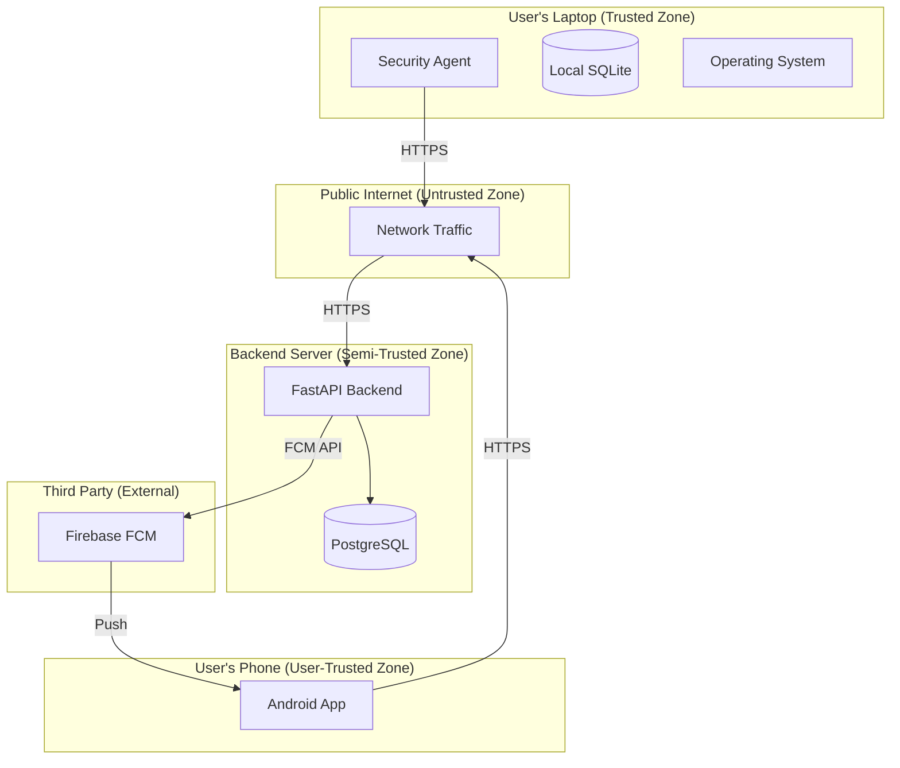

# Threat Model — AI-Powered Personal Security Layer

---

## Methodology

This threat model uses the **STRIDE** framework as an organizational structure:

| Category | Meaning |
|---|---|
| **S** | Spoofing — Impersonating a user, device, or service |
| **T** | Tampering — Modifying data or code without authorization |
| **R** | Repudiation — Denying actions without a way to prove otherwise |
| **I** | Information Disclosure — Exposing data to unauthorized parties |
| **D** | Denial of Service — Disrupting availability of a service |
| **E** | Elevation of Privilege — Gaining higher access than authorized |

Each threat is documented with:
```
Threat → Impact → Likelihood → Mitigation → Residual Risk
```

---

## 1. Assets

These are the valuable components that threats target:

| Asset | Description | Value |
|---|---|---|
| User's system telemetry | Process, file, network, and startup data collected by the agent | High |
| Security event history | Historical log of all detected events and alerts | High |
| User credentials | Email, password, JWT tokens | Critical |
| Device credentials | Device authentication token | High |
| Security alerts | Threat notifications and their context | High |
| Agent binary and configuration | The security tool itself | High |
| Backend database | All event, alert, and user data | Critical |
| Detection rules and ML model | Intellectual property; also an evasion target | Medium |
| Push notification delivery | Alerting channel to the user | Medium |

---

## 2. Trust Boundaries



**Trust boundary crossings that require controls:**

1. Agent → Internet → Backend (HTTPS + device token)
2. Mobile App → Internet → Backend (HTTPS + user JWT)
3. Backend → FCM → Mobile (FCM service key; FCM is third-party)

---

## 3. Threat Actors

| Actor | Capability | Motivation |
|---|---|---|
| **Remote attacker** | Network access; malware delivery via phishing | Data theft, ransomware, persistence |
| **Local attacker** | Physical or OS-level access to the laptop | Disable monitoring, tamper with agent, data exfiltration |
| **Malware on the monitored system** | Runs as the current user or with elevated privileges | Evade detection, disable the agent |
| **Compromised FCM** | Hypothetical third-party service compromise | Alert manipulation, fake notifications |
| **Backend server attacker** | Network access to backend | Steal security event history, user data |

---

## 4. Attack Surface

| Surface | Description |
|---|---|
| Agent API client | Outbound HTTPS from agent to backend |
| Backend REST API endpoints | All HTTP endpoints exposed to the internet |
| Agent local file system | Config files, SQLite database, model files |
| Agent process | Running in userspace; visible to other processes |
| Mobile app ↔ backend | REST API over the internet |
| FCM push notification channel | Third-party notification delivery |
| Detection rules (YAML) | Configuration files that influence detection behavior |
| ML model file (joblib) | Serialized model loaded at startup |

---

## 5. Threats — Laptop Agent

---

### THREAT-LA-01: Malware Disables the Agent Process

| Field | Value |
|---|---|
| **Category** | Denial of Service |
| **Actor** | Malware running with user or elevated privileges |
| **Attack** | Kill the agent process (e.g., `taskkill /f /im agent.exe`) |
| **Impact** | Security monitoring ceases; subsequent malicious activity goes undetected |
| **Likelihood** | Medium — attackers actively target security tools |
| **Mitigation** | Register agent as a Windows service with automatic restart; monitor for self-termination |
| **Residual Risk** | A privileged attacker can still prevent restart by modifying service configuration or disabling the service manager entry |

---

### THREAT-LA-02: Agent Configuration Tampering

| Field | Value |
|---|---|
| **Category** | Tampering |
| **Actor** | Local attacker or malware |
| **Attack** | Modify `config.yaml` to disable monitoring of certain directories, raise alert thresholds, or add process exclusions |
| **Impact** | Detection gaps; agent monitors less or not at all |
| **Likelihood** | Medium |
| **Mitigation** | Validate config file hash at startup; restrict file permissions; log config changes |
| **Residual Risk** | If the attacker has write access to the config file, they can change the hash reference too |

---

### THREAT-LA-03: Detection Rule Manipulation

| Field | Value |
|---|---|
| **Category** | Tampering |
| **Actor** | Malware with file write access |
| **Attack** | Modify YAML rule files to remove rules that would detect the malware's own behavior |
| **Impact** | Specific attack patterns bypass rule-based detection |
| **Likelihood** | Low-Medium |
| **Mitigation** | File permissions restrict who can write rule files; rule file hash verification at startup; backend delivers authoritative rule set (Phase 2) |
| **Residual Risk** | AI anomaly detection still runs independently; not all evasion paths are closed |

---

### THREAT-LA-04: ML Model File Replacement

| Field | Value |
|---|---|
| **Category** | Tampering |
| **Actor** | Malware or local attacker |
| **Attack** | Replace the serialized `.joblib` model with a modified one that always outputs low anomaly scores |
| **Impact** | AI-based detection is silently disabled |
| **Likelihood** | Low |
| **Mitigation** | Model file hash verification at load time; model file permissions; out-of-band model delivery (Phase 2) |
| **Residual Risk** | Rule-based detection is unaffected |

---

### THREAT-LA-05: Device Credential Theft

| Field | Value |
|---|---|
| **Category** | Information Disclosure / Spoofing |
| **Actor** | Malware or local attacker |
| **Attack** | Extract the device token from OS Credential Manager |
| **Impact** | Attacker can impersonate the device: inject fake events, manipulate alerts, disrupt sync |
| **Likelihood** | Low-Medium (OS Credential Manager has protection; but privileged malware can bypass) |
| **Mitigation** | OS Credential Manager (Windows Credential Manager); token rotation capability; anomalous event patterns from a compromised device could be detected |
| **Residual Risk** | Privileged malware can extract credentials from Windows Credential Manager; hardware-backed storage (TPM) not implemented in MVP |

---

### THREAT-LA-06: Agent Blind Spot via Process Exclusion Abuse

| Field | Value |
|---|---|
| **Category** | Elevation of Privilege / Tampering |
| **Actor** | Malware |
| **Attack** | Rename malicious process to match an exclusion list entry (e.g., rename malware to `onedrive.exe`) |
| **Impact** | Malicious process evades process-name-based exclusions |
| **Likelihood** | Medium |
| **Mitigation** | Exclusions should be based on path + signature, not process name alone; executable path legitimacy check |
| **Residual Risk** | Sophisticated attackers can still spoof process metadata |

---

## 6. Threats — Backend

---

### THREAT-BE-01: Unauthenticated API Access

| Field | Value |
|---|---|
| **Category** | Spoofing / Information Disclosure |
| **Actor** | Remote attacker |
| **Attack** | Attempt to access event history, alerts, or device data without valid credentials |
| **Impact** | Unauthorized access to sensitive security data |
| **Likelihood** | Low (if authentication is correctly implemented) |
| **Mitigation** | All endpoints require authentication; Pydantic validates tokens on every request |
| **Residual Risk** | Implementation bugs in authentication middleware could create bypass |

---

### THREAT-BE-02: Injection via Event Payload

| Field | Value |
|---|---|
| **Category** | Tampering |
| **Actor** | Compromised agent or attacker with device token |
| **Attack** | Send a specially crafted event payload containing SQL injection, XSS, or malicious JSONB data |
| **Impact** | Database corruption, data leakage, or XSS in mobile/web frontend |
| **Likelihood** | Low (mitigated by ORM and Pydantic) |
| **Mitigation** | Pydantic validation on all inputs; SQLAlchemy ORM (parameterized queries); JSONB schema validation |
| **Residual Risk** | XSS could affect a future web dashboard; mobile app should sanitize rendered content |

---

### THREAT-BE-03: Database Exfiltration

| Field | Value |
|---|---|
| **Category** | Information Disclosure |
| **Actor** | Remote attacker who compromises the backend server |
| **Attack** | Gain access to PostgreSQL and dump the database |
| **Impact** | Exposure of all users' security event history, device information, and password hashes |
| **Likelihood** | Low (requires server compromise) |
| **Mitigation** | bcrypt for passwords (computationally expensive to crack); database not exposed publicly; least-privilege DB credentials; disk-level encryption at rest |
| **Residual Risk** | Security event history and device data exposed; password hashes require offline cracking |

---

### THREAT-BE-04: Denial of Service via Event Flooding

| Field | Value |
|---|---|
| **Category** | Denial of Service |
| **Actor** | Compromised device or attacker with device token |
| **Attack** | Send thousands of events per second to overwhelm the backend |
| **Impact** | Backend becomes unavailable to other devices and the mobile app |
| **Likelihood** | Low-Medium |
| **Mitigation** | Rate limiting (100 events/min per device); batch endpoint size limit (5 MB); circuit breaker on database writes |
| **Residual Risk** | Rate limiting can be saturated by many simultaneously compromised devices (unlikely single-user scenario) |

---

## 7. Threats — Mobile Application

---

### THREAT-MB-01: JWT Token Theft from Mobile

| Field | Value |
|---|---|
| **Category** | Information Disclosure / Spoofing |
| **Actor** | Malicious app on the same device, or physical access to unlocked phone |
| **Attack** | Extract JWT token from insecure storage |
| **Impact** | Attacker can view security data and acknowledge/dismiss alerts |
| **Likelihood** | Low (if `flutter_secure_storage` is used correctly) |
| **Mitigation** | Store tokens in Android Keystore via `flutter_secure_storage`; short JWT expiry (60 min); refresh token rotation |
| **Residual Risk** | Root/jailbroken devices can bypass Keystore protections |

---

### THREAT-MB-02: Alert Manipulation via FCM Spoofing

| Field | Value |
|---|---|
| **Category** | Tampering / Spoofing |
| **Actor** | Attacker with access to FCM service key |
| **Attack** | Send fake push notifications claiming false alerts or dismiss real ones |
| **Impact** | User misled about security posture |
| **Likelihood** | Very Low |
| **Mitigation** | FCM notifications contain only alert ID and severity; actual alert content is fetched from the backend API (which requires authentication); spoofed FCM notification cannot modify backend data |
| **Residual Risk** | Legitimate-looking but fake notifications could cause alert fatigue or user confusion |

---

## 8. Threats — Communication Channel

---

### THREAT-COM-01: Man-in-the-Middle Attack

| Field | Value |
|---|---|
| **Category** | Information Disclosure / Tampering |
| **Actor** | Network attacker (rogue Wi-Fi, ISP-level interception) |
| **Attack** | Intercept or modify HTTPS traffic between agent and backend, or mobile and backend |
| **Impact** | Exposure of security event data; injection of fake events or responses |
| **Likelihood** | Low (TLS prevents content interception; certificate pinning would prevent MITM) |
| **Mitigation** | TLS 1.2+ enforced; CA certificate validation; certificate pinning (Phase 2) |
| **Residual Risk** | Without certificate pinning, a compromised CA cert could enable MITM; not addressed in MVP |

---

## 9. STRIDE Summary

| Category | Primary Threats Identified |
|---|---|
| **Spoofing** | Device credential theft (LA-05), Unauthenticated API access (BE-01), JWT theft (MB-01) |
| **Tampering** | Config tampering (LA-02), Rule manipulation (LA-03), Model replacement (LA-04), Event injection (BE-02) |
| **Repudiation** | Backend audit log gaps; agent action logging not tamper-proof in MVP |
| **Information Disclosure** | Database exfiltration (BE-03), JWT theft (MB-01), MITM (COM-01) |
| **Denial of Service** | Agent killed (LA-01), Event flooding (BE-04) |
| **Elevation of Privilege** | Blind spot via exclusion abuse (LA-06), Backend compromise leading to DB access (BE-03) |

---

## 10. Out-of-Scope Threats

The following threats are acknowledged but are **out of scope** for this project:

| Threat | Reason out of scope |
|---|---|
| Physical theft of the laptop | Physical security is outside the system's scope |
| Kernel-level rootkit | Agent does not operate at kernel level; cannot detect kernel rootkits |
| Firmware attacks | Far below the monitoring layer |
| Supply chain attack on Python dependencies | Mitigated by dependency pinning; full supply chain audit is out of scope |
| Attacks on Firebase (FCM) infrastructure | Third-party; not in our control |

---

*Document version: 1.0 | Last updated: 2026-09-16*
